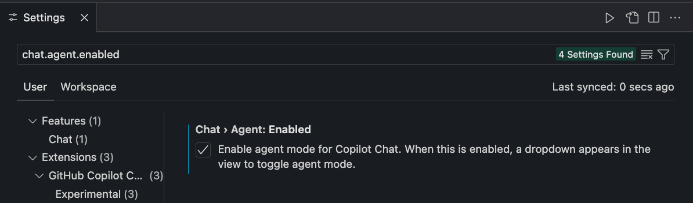
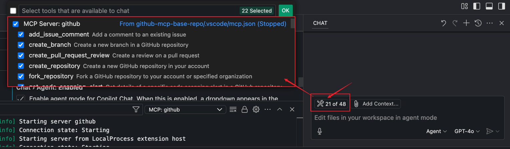
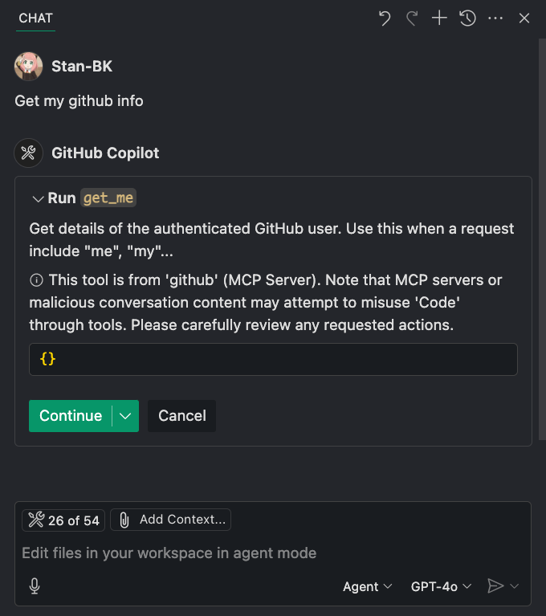
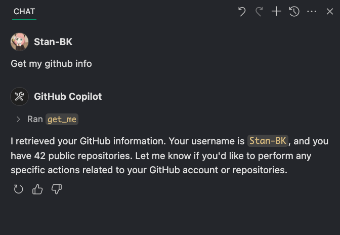
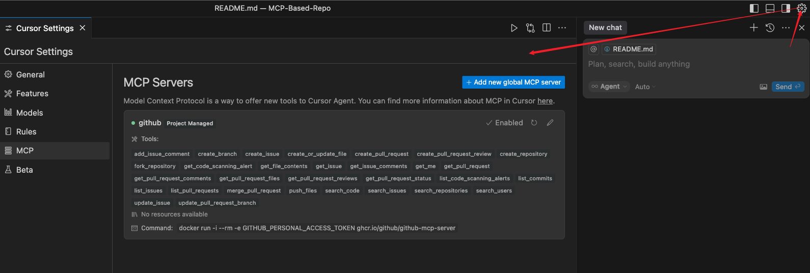

# MCP-Based-Repo

Provide a simple MCP server integration in `VSCode` and `Cursor`.

## In VSCode

### Setup
- First need to enable agent mode in setting (**!! Important**)

    

- Then u can straight to choose needed MCP server for enhance ur agent mode copilot!

    

- Other MCP server integration can be added in `.vscode/mcp.json` then `VSCode` will identify them.

### Example
I try to get my github account based info which the way github-mcp-server had exposed for me. So copilot integrate with `VSCode` (Here as a MCP Client) can related the server's capability and get use of it.

After I permit that bevahior, finally I can get the response from github-mcp-server.

## In Cursor

### Setup
- MCP server in `Cursor` is configure in `.cursor/mcp.json`, then `Cursor` will identifies and integrates them automatically.

  

- Then u can straight to ask for help and enjoy the seemless experience like before, that means `Cursor` will implicity integrate the needed MCP server for u.
